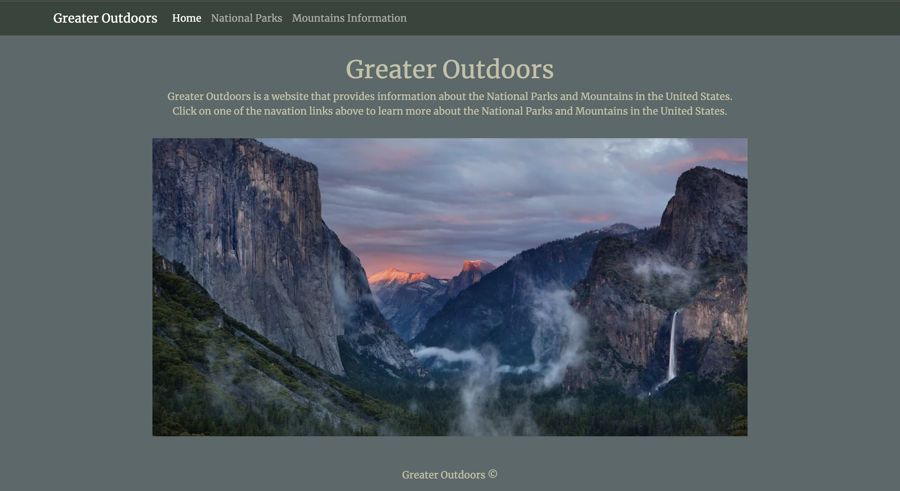
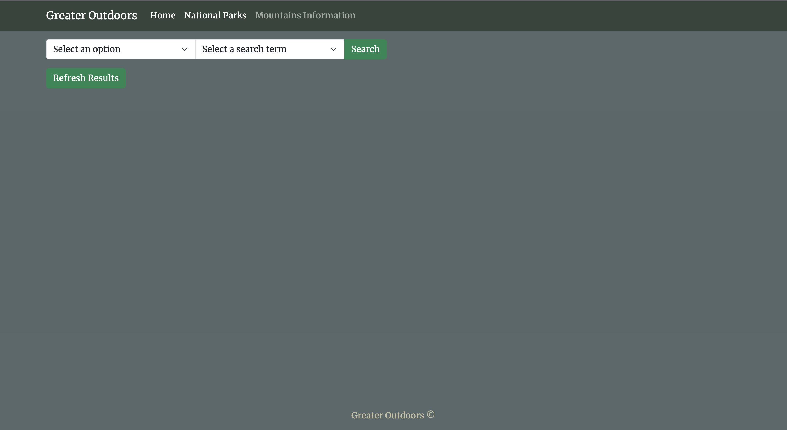
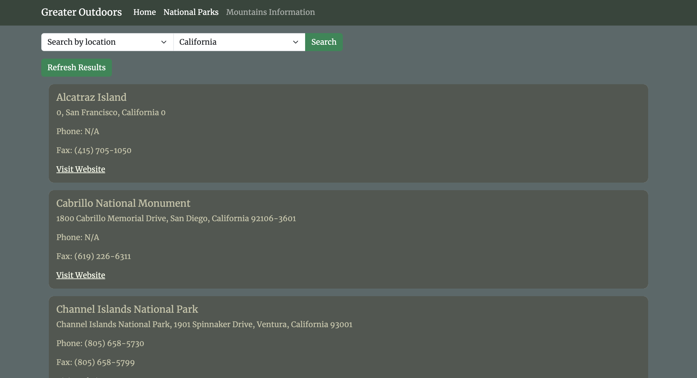
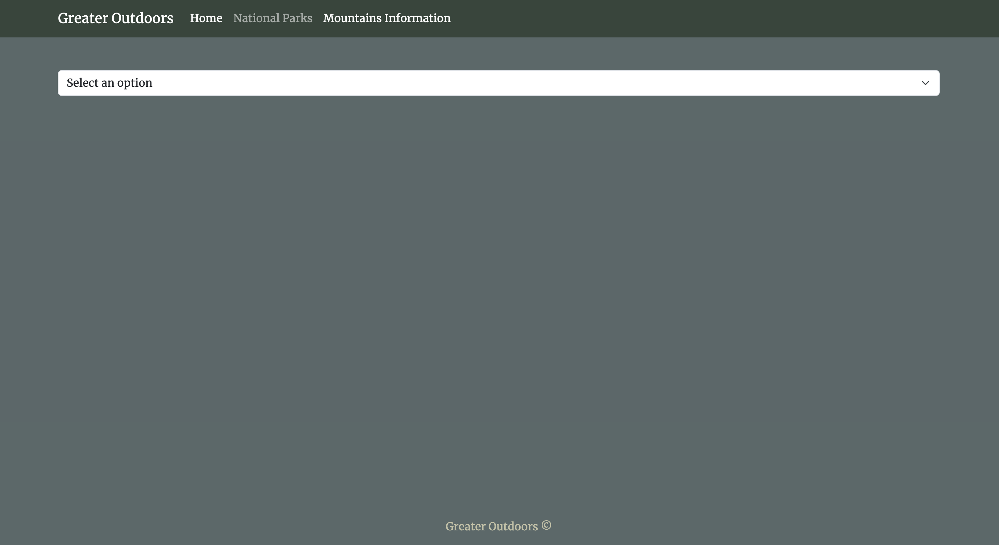
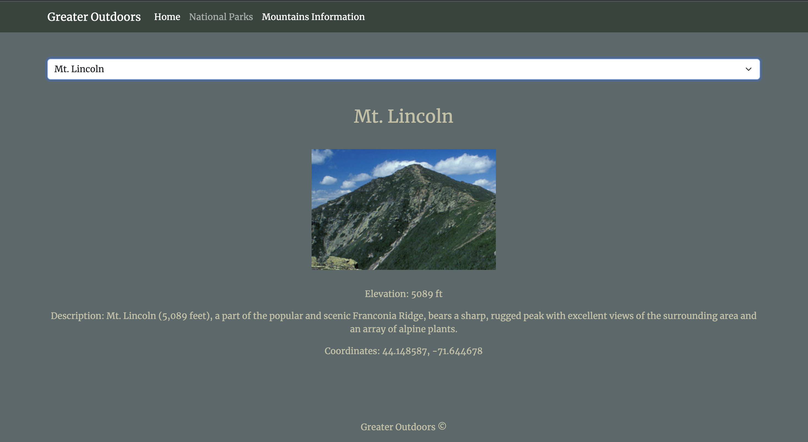

# Capstone2_EnjoyTheOutdoors

## Project Description

This project is a web application that helps users find national parks and mountains. Users can search for activities based on location or park type. They can also click on a mountain using a dropdown and it will display all information about that mountain for them.

## Images
Home Page

National Parks Pages

Mountains Pages

## Interesting Javascript

I've had more problems on the CSS than the Javascript. The biggest problem I did have was making my refresh button though.
